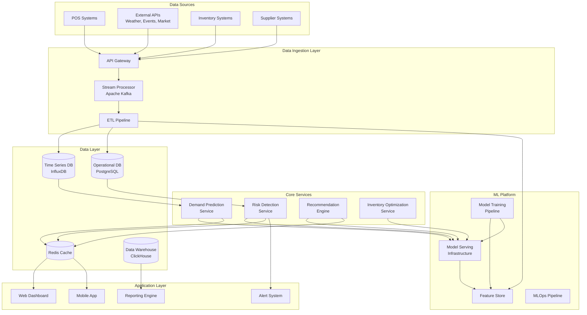

# Design Document: AI-Powered Inventory and Demand Intelligence Platform

> **Implementation Status**: This platform has been successfully implemented and deployed as RetailMind. Built entirely on AWS using Java 21/Spring Boot 3.2 on Lambda, React 18/TypeScript frontend, DynamoDB, and Amazon Bedrock Nova Pro for AI capabilities. The system includes bilingual support (Hindi/English), WhatsApp integration, and multi-store analytics.

## Overview

The AI-powered Inventory and Demand Intelligence platform is a sophisticated decision-support system that combines advanced machine learning algorithms with real-time data processing to optimize inventory management for Indian retail operations. The system addresses the unique challenges of kirana stores and quick-commerce operators by providing accurate demand predictions, proactive risk detection, and actionable recommendations.

### Key Design Principles

- **Real-time Intelligence**: Process streaming data from multiple sources with sub-minute latency
- **Contextual Awareness**: Incorporate local factors (festivals, weather, events) into predictions
- **Scalable Architecture**: Support growth from single stores to enterprise-scale operations
- **User-Centric Design**: Provide intuitive interfaces for users with varying technical expertise
- **Actionable Insights**: Generate specific recommendations with confidence levels and expected outcomes

## Architecture

The platform follows a microservices architecture with event-driven communication, designed for high availability and horizontal scalability.



### Technology Stack

**Backend Services:**
- **API Gateway**: AWS API Gateway for request routing and rate limiting
- **Compute**: AWS Lambda with Java 21 runtime for serverless execution
- **Framework**: Spring Boot 3.2 with AWS Serverless Java Container
- **Message Queue**: Amazon SQS for asynchronous processing
- **Caching**: Amazon ElastiCache (Redis) for frequently accessed data

**AI/ML Platform:**
- **Generative AI**: Amazon Bedrock with Nova Pro model for recommendations and chat
- **Demand Forecasting**: Custom Java implementation with statistical models
- **Model Storage**: Amazon S3 for model artifacts and versioning
- **Monitoring**: Amazon CloudWatch for metrics and logging

**Data Storage:**
- **Primary Database**: Amazon DynamoDB (NoSQL) for operational data
- **Time Series**: DynamoDB with TTL for historical sales data
- **Analytics**: Amazon Athena for ad-hoc queries on S3 data
- **Cache**: Amazon ElastiCache (Redis) for predictions and recommendations

**Frontend:**
- **Web Dashboard**: React 18 with TypeScript and Material-UI (MUI)
- **Hosting**: Amazon S3 + CloudFront for static site hosting
- **Visualization**: Recharts for interactive dashboards
- **State Management**: React Hooks
- **Build Tool**: Vite

## Components and Interfaces

### 1. Data Ingestion Service

**Responsibilities:**
- Collect data from POS systems, inventory management systems, and external APIs
- Validate, clean, and normalize incoming data streams
- Route data to appropriate storage systems and downstream services

**Key Interfaces:**
```java
@Service
public interface DataIngestionService {
    boolean ingestPosData(String storeId, List<Transaction> transactions);
    boolean ingestInventoryData(String storeId, List<InventoryItem> inventory);
    boolean ingestExternalData(String dataType, Map<String, Object> payload);
    ValidationResult validateDataQuality(Object data);
}
```

### 2. Demand Prediction Service

**Responsibilities:**
- Generate demand forecasts for individual SKUs across different time horizons
- Incorporate external factors (weather, events, seasonality) into predictions
- Provide confidence intervals and prediction explanations

**Core Algorithms:**
- **Moving Average**: For products with stable demand patterns
- **Exponential Smoothing**: For trending products
- **Seasonal Decomposition**: For products with clear seasonal patterns
- **Amazon Bedrock**: For contextual recommendations and insights

**Key Interfaces:**
```java
@Service
public interface DemandPredictionService {
    DemandForecast predictDemand(String skuId, String storeId, int horizonDays);
    List<DemandForecast> batchPredict(String storeId, List<String> skuList);
    boolean updateModel(String skuId, TimeSeriesData newData);
    PredictionExplanation explainPrediction(String predictionId);
}
```

### 3. Risk Detection Service

**Responsibilities:**
- Monitor inventory levels and identify potential stockout risks
- Detect products approaching expiry dates
- Identify slow-moving inventory and overstock situations
- Generate risk scores and prioritized alerts

**Risk Detection Algorithms:**
- **Stockout Risk**: Based on current inventory, demand velocity, and lead times
- **Expiry Risk**: Considering shelf life, demand patterns, and current stock levels
- **Overstock Detection**: Using inventory turnover ratios and demand trends
- **Anomaly Detection**: Statistical methods to identify unusual demand patterns

**Key Interfaces:**
```java
@Service
public interface RiskDetectionService {
    StockoutRisk detectStockoutRisk(String skuId, String storeId);
    List<ExpiryRisk> detectExpiryRisk(String storeId);
    List<OverstockRisk> detectOverstock(String storeId);
    double calculateRiskScore(Risk risk);
}
```

### 4. Recommendation Engine

**Responsibilities:**
- Generate actionable recommendations based on predictions and risks
- Calculate expected outcomes and confidence levels for each recommendation
- Prioritize recommendations by potential impact and implementation complexity

**Recommendation Types:**
- **Reorder Recommendations**: Optimal quantities, timing, and suppliers
- **Pricing Actions**: Dynamic discounting for products near expiry
- **Redistribution**: Moving inventory between locations
- **Promotional Strategies**: Bundling and cross-selling opportunities

**Key Interfaces:**
```java
@Service
public interface RecommendationEngine {
    List<ReorderRecommendation> generateReorderRecommendations(String storeId);
    List<PricingRecommendation> generatePricingRecommendations(String storeId);
    List<RedistributionRecommendation> generateRedistributionRecommendations(String regionId);
    List<Recommendation> rankRecommendations(List<Recommendation> recommendations);
}
```

### 5. Inventory Optimization Service

**Responsibilities:**
- Calculate optimal reorder points and safety stock levels
- Optimize order quantities considering demand variability and costs
- Balance service levels with inventory investment

**Optimization Algorithms:**
- **Reorder Point Calculation**: ROP = (Average Daily Demand × Lead Time) + Safety Stock
- **Safety Stock Optimization**: Based on demand variability, lead time uncertainty, and service level targets
- **Economic Order Quantity (EOQ)**: Balancing ordering costs with holding costs
- **Multi-echelon Optimization**: For quick-commerce networks with multiple fulfillment centers

**Key Interfaces:**
```java
@Service
public interface InventoryOptimizationService {
    ReorderPoint calculateReorderPoint(String skuId, String storeId);
    SafetyStock optimizeSafetyStock(String skuId, String storeId, double serviceLevel);
    OrderQuantity calculateOptimalOrderQuantity(String skuId, String storeId);
    MultiLocationPlan optimizeMultiLocationInventory(String regionId);
}
```

## Data Models

### Core Entities

```java
@DynamoDbBean
@Data
@Builder
public class Store {
    @DynamoDbPartitionKey
    private String pk;  // "STORE"
    
    @DynamoDbSortKey
    private String sk;  // "STORE#{storeId}"
    
    private String storeId;
    private String name;
    private String location;
    private StoreType storeType;  // KIRANA, DARK_STORE, WAREHOUSE
    private Map<String, Double> capacityConstraints;
    private TimeRange operatingHours;
    private Double totalDailySalesAverage;
}

@DynamoDbBean
@Data
@Builder
public class SKU {
    @DynamoDbPartitionKey
    private String pk;  // "STORE#{storeId}"
    
    @DynamoDbSortKey
    private String sk;  // "SKU#{skuId}"
    
    private String skuId;
    private String name;
    private String category;
    private String subcategory;
    private String brand;
    private Double unitCost;
    private Double sellingPrice;
    private Integer shelfLifeDays;
    private String barcode;
    private StorageRequirements storageRequirements;
}

@DynamoDbBean
@Data
@Builder
public class InventoryItem {
    @DynamoDbPartitionKey
    private String pk;  // "STORE#{storeId}#SKU#{skuId}"
    
    @DynamoDbSortKey
    private String sk;  // "BATCH#{batchId}"
    
    private String storeId;
    private String skuId;
    private String batchId;
    private Integer currentStock;
    private Integer reservedStock;
    private Integer availableStock;
    private Integer reorderPoint;
    private Integer safetyStock;
    private String expiryDate;  // ISO-8601
    private String lastRestockDate;
    private Instant lastUpdated;
    private List<BatchInfo> batchInfo;
}

@Data
@Builder
public class DemandForecast {
    private String forecastId;
    private String skuId;
    private String storeId;
    private LocalDate forecastDate;
    private Double predictedDemand;
    private ConfidenceInterval confidenceInterval;
    private String modelUsed;
    private Map<String, Object> externalFactors;
    private Instant createdAt;
}

@DynamoDbBean
@Data
@Builder
public class Risk {
    @DynamoDbPartitionKey
    private String pk;  // "STORE#{storeId}"
    
    @DynamoDbSortKey
    private String sk;  // "RISK#{riskId}"
    
    private String riskId;
    private RiskType riskType;  // STOCKOUT, EXPIRY, OVERSTOCK, ANOMALY
    private String skuId;
    private String storeId;
    private RiskSeverity severity;  // LOW, MEDIUM, HIGH, CRITICAL
    private Double riskScore;
    private Double estimatedImpact;
    private Duration timeToImpact;
    private Instant detectedAt;
    private String status;  // ACTIVE, RESOLVED, IGNORED
}

@DynamoDbBean
@Data
@Builder
public class Recommendation {
    @DynamoDbPartitionKey
    private String pk;  // "STORE#{storeId}"
    
    @DynamoDbSortKey
    private String sk;  // "REC#{recommendationId}"
    
    private String recommendationId;
    private RecommendationType recommendationType;
    private String skuId;
    private String storeId;
    private String action;
    private Map<String, Object> parameters;
    private String expectedOutcome;
    private Double confidenceLevel;
    private ComplexityLevel implementationComplexity;
    private Double estimatedRoi;
    private Instant createdAt;
    private String status;  // PENDING, ACCEPTED, REJECTED, IMPLEMENTED
}
```

### Time Series Data Models

```java
@DynamoDbBean
@Data
@Builder
public class SalesTransaction {
    @DynamoDbPartitionKey
    private String pk;  // "STORE#{storeId}#SKU#{skuId}"
    
    @DynamoDbSortKey
    private String sk;  // "SALE#{timestamp}"
    
    private String transactionId;
    private String storeId;
    private String skuId;
    private Integer quantity;
    private Double unitPrice;
    private Double totalAmount;
    private Instant timestamp;
    private String customerId;
    
    @DynamoDbSecondarySortKey(indexNames = "TimestampIndex")
    private Long ttl;  // For automatic cleanup of old data
}

@DynamoDbBean
@Data
@Builder
public class InventoryMovement {
    @DynamoDbPartitionKey
    private String pk;  // "STORE#{storeId}#SKU#{skuId}"
    
    @DynamoDbSortKey
    private String sk;  // "MOVEMENT#{timestamp}"
    
    private String movementId;
    private String storeId;
    private String skuId;
    private MovementType movementType;  // SALE, PURCHASE, TRANSFER, ADJUSTMENT
    private Integer quantity;
    private Instant timestamp;
    private String referenceId;
}

@DynamoDbBean
@Data
@Builder
public class ExternalFactor {
    @DynamoDbPartitionKey
    private String pk;  // "LOCATION#{location}"
    
    @DynamoDbSortKey
    private String sk;  // "FACTOR#{factorType}#{timestamp}"
    
    private String factorType;  // WEATHER, EVENT, HOLIDAY, MARKET_PRICE
    private String location;
    private Instant timestamp;
    private Object value;  // Can be String, Double, or Map
    private List<String> impactCategories;
}

@Data
@Builder
public class UserFeedback {
    private String feedbackId;
    private String userId;
    private String recommendationId;
    private FeedbackType feedbackType;  // ACCEPTED, REJECTED, MODIFIED
    private String comments;
    private Map<String, Object> modifications;
    private Instant createdAt;
}
```

## Correctness Properties

*A property is a characteristic or behavior that should hold true across all valid executions of a system—essentially, a formal statement about what the system should do. Properties serve as the bridge between human-readable specifications and machine-verifiable correctness guarantees.*

Based on the prework analysis of acceptance criteria, the following properties capture the essential correctness requirements for the AI-powered inventory and demand intelligence platform:

### Demand Prediction Properties

**Property 1: Prediction Accuracy**
*For any* SKU with sufficient historical sales data, the demand prediction accuracy should be 85% or higher for 7-day forecasts
**Validates: Requirements 1.1**

**Property 2: External Factor Responsiveness**
*For any* external factor change (weather, festivals, events), demand predictions should be updated within 2 hours of data availability
**Validates: Requirements 1.2**

**Property 3: New SKU Prediction**
*For any* newly introduced SKU, the system should generate demand predictions using similar product patterns and market intelligence
**Validates: Requirements 1.3**

**Property 4: Seasonality Integration**
*For any* product with detected seasonal patterns, demand forecasts should incorporate seasonality adjustments
**Validates: Requirements 1.4**

**Property 5: Location-Specific Predictions**
*For any* multi-location scenario, the system should provide location-specific demand predictions accounting for local factors
**Validates: Requirements 1.5**

### Risk Detection Properties

**Property 6: Stockout Alert Timing**
*For any* inventory approaching reorder points, stockout risk alerts should be generated 24-48 hours before expected stockout
**Validates: Requirements 2.1**

**Property 7: Expiry Risk Detection**
*For any* product approaching expiry dates, the system should flag expiry risks based on current demand velocity and remaining shelf life
**Validates: Requirements 2.2**

**Property 8: Anomaly Detection Timing**
*For any* significant deviation from demand predictions, anomalies should be detected and users alerted within 4 hours
**Validates: Requirements 2.3**

**Property 9: Slow-Moving Stock Identification**
*For any* inventory with turnover rates below optimal thresholds, slow-moving stock risks should be identified
**Validates: Requirements 2.4**

**Property 10: Supply Chain Disruption Assessment**
*For any* detected supply chain disruption, the system should assess impact on inventory availability and generate risk alerts
**Validates: Requirements 2.5**

### Recommendation Engine Properties

**Property 11: Risk-Based Recommendations**
*For any* detected inventory risk, the system should provide specific action recommendations with expected outcomes and confidence levels
**Validates: Requirements 3.1**

**Property 12: Complete Reorder Recommendations**
*For any* reorder recommendation, the system should specify optimal order quantities, timing, and supplier selection
**Validates: Requirements 3.2**

**Property 13: Expiry-Based Action Recommendations**
*For any* product near expiry, the system should recommend appropriate discount strategies, bundling options, or redistribution opportunities
**Validates: Requirements 3.3**

**Property 14: Overstock Resolution Recommendations**
*For any* overstock situation, the system should suggest redistribution to other locations or promotional strategies
**Validates: Requirements 3.4**

**Property 15: Recommendation Ranking**
*For any* scenario with multiple possible actions, recommendations should be ranked by expected ROI and implementation complexity
**Validates: Requirements 3.5**

### Data Processing Properties

**Property 16: POS Data Processing Timing**
*For any* POS transaction, data should be ingested and processed within 15 minutes
**Validates: Requirements 4.1**

**Property 17: Inventory Update Timing**
*For any* inventory level change, stock positions should be updated and risk assessments recalculated within 30 minutes
**Validates: Requirements 4.2**

**Property 18: External Data Integration Timing**
*For any* external data update (weather, events, market prices), changes should be incorporated into predictions within 2 hours
**Validates: Requirements 4.3**

**Property 19: Data Accuracy Maintenance**
*For any* integrated data source, the system should maintain data accuracy above 99%
**Validates: Requirements 4.4**

**Property 20: Failure Recovery**
*For any* data integration failure, the system should alert administrators and continue operating with last known good data
**Validates: Requirements 4.5**

### Multi-Location Intelligence Properties

**Property 21: Consolidated Dashboard Completeness**
*For any* multi-location management scenario, consolidated dashboards should show inventory status across all stores
**Validates: Requirements 5.1**

**Property 22: Redistribution Opportunity Identification**
*For any* scenario with redistribution opportunities, the system should identify optimal product movements between locations
**Validates: Requirements 5.2**

**Property 23: Regional Procurement Recommendations**
*For any* emerging regional demand pattern, the system should recommend centralized procurement strategies
**Validates: Requirements 5.3**

**Property 24: Redistribution Cost-Benefit Analysis**
*For any* redistribution recommendation, the system should calculate costs and benefits before recommending inventory transfers
**Validates: Requirements 5.4**

### System Performance Properties

**Property 25: Load Prioritization**
*For any* system overload scenario, critical functions (risk alerts, real-time recommendations) should be prioritized over batch processing
**Validates: Requirements 6.5**

### User Interface Properties

**Property 26: Critical Alert Display**
*For any* user accessing the platform, critical alerts and recommendations should be displayed prominently on the main dashboard
**Validates: Requirements 7.1**

**Property 27: Recommendation Presentation**
*For any* recommendation presentation, the system should use simple language and visual indicators to communicate urgency and importance
**Validates: Requirements 7.2**

**Property 28: Drill-Down Capabilities**
*For any* request for detailed information, the system should provide drill-down capabilities without overwhelming the primary interface
**Validates: Requirements 7.3**

**Property 29: Mobile Responsiveness**
*For any* mobile access, the system should support responsive design optimized for smartphone usage
**Validates: Requirements 7.4**

**Property 30: Language Localization**
*For any* language preference setting, the system should support Hindi and English interfaces with localized terminology
**Validates: Requirements 7.5**

### Security Properties

**Property 31: Data Encryption at Rest**
*For any* stored customer data, the system should encrypt all data at rest using AES-256 encryption
**Validates: Requirements 8.1**

**Property 32: Transmission Security**
*For any* data transmission, the system should use TLS 1.3 or higher for all communications
**Validates: Requirements 8.2**

**Property 33: Multi-Factor Authentication**
*For any* administrative function access, the system should require multi-factor authentication
**Validates: Requirements 8.3**

**Property 34: Audit Logging**
*For any* data access or modification, the system should maintain audit logs for compliance purposes
**Validates: Requirements 8.4**

**Property 35: Data Sharing Consent**
*For any* data sharing requirement, the system should obtain explicit consent and provide granular privacy controls
**Validates: Requirements 8.5**

### Integration Properties

**Property 36: RESTful API Provision**
*For any* third-party system data request, the system should provide RESTful APIs with comprehensive documentation
**Validates: Requirements 9.1**

**Property 37: Data Format Support**
*For any* POS system integration, the system should support common retail data formats (JSON, XML, CSV)
**Validates: Requirements 9.2**

**Property 38: Webhook Delivery Timing**
*For any* configured webhook notification, real-time alerts should be delivered to external systems within 60 seconds
**Validates: Requirements 9.3**

**Property 39: SDK Library Availability**
*For any* supported programming language (Python, JavaScript, Java), the system should provide SDK libraries
**Validates: Requirements 9.4**

**Property 40: Custom Integration Flexibility**
*For any* custom integration need, the system should support flexible data mapping and transformation capabilities
**Validates: Requirements 9.5**

### Reporting Properties

**Property 41: Pre-Built Report Templates**
*For any* report generation request, the system should provide pre-built templates for common KPIs (inventory turnover, stockout rates, wastage reduction)
**Validates: Requirements 10.1**

**Property 42: Performance Tracking**
*For any* performance analysis, the system should track prediction accuracy and recommendation effectiveness over time
**Validates: Requirements 10.2**

**Property 43: Trend Analysis**
*For any* period comparison, the system should highlight trends and provide variance analysis with statistical significance
**Validates: Requirements 10.3**

**Property 44: Custom Report Creation**
*For any* custom report creation request, the system should support drag-and-drop interface for non-technical users
**Validates: Requirements 10.4**

**Property 45: Audit Report Generation**
*For any* regulatory compliance requirement, the system should generate audit reports with detailed transaction histories
**Validates: Requirements 10.5**

<function_calls>
<invoke name="prework">
<parameter name="featureName">inventory-demand-intelligence

## Error Handling

The platform implements comprehensive error handling strategies to ensure system resilience and data integrity:

### Data Quality Issues

**Missing or Incomplete Data:**
- Implement data validation pipelines with configurable quality thresholds
- Use interpolation and imputation techniques for missing time series data
- Maintain data lineage tracking to identify and resolve quality issues
- Provide fallback mechanisms using historical averages or similar product patterns

**Data Inconsistencies:**
- Implement cross-validation between different data sources (POS vs inventory systems)
- Use statistical outlier detection to identify and flag suspicious data points
- Maintain audit trails for all data corrections and adjustments
- Provide manual override capabilities for domain experts

### Model Performance Degradation

**Prediction Accuracy Decline:**
- Implement continuous model monitoring with accuracy thresholds
- Trigger automatic model retraining when performance drops below acceptable levels
- Maintain multiple model versions with A/B testing capabilities
- Provide model explainability features to diagnose performance issues

**Concept Drift Detection:**
- Monitor statistical properties of input features over time
- Detect shifts in demand patterns, seasonality, or external factor relationships
- Implement adaptive learning mechanisms to handle gradual concept drift
- Provide alerts when significant distribution changes are detected

### System Failures

**Service Unavailability:**
- Implement circuit breaker patterns to prevent cascade failures
- Use graceful degradation with cached predictions and recommendations
- Maintain service health monitoring with automatic failover capabilities
- Provide manual intervention capabilities for critical system functions

**Data Pipeline Failures:**
- Implement retry mechanisms with exponential backoff for transient failures
- Use dead letter queues for failed message processing
- Maintain data pipeline monitoring with automated recovery procedures
- Provide data replay capabilities for recovering from extended outages

### External Dependencies

**Third-Party API Failures:**
- Implement timeout and retry policies for external API calls
- Use cached data and fallback mechanisms when external services are unavailable
- Monitor external service health and implement alternative data sources
- Provide manual data entry capabilities for critical external data

**Integration Failures:**
- Implement robust error handling for POS and inventory system integrations
- Use message queuing to handle temporary connectivity issues
- Provide data synchronization mechanisms to recover from integration failures
- Maintain integration health monitoring with automated alerting

## Testing Strategy

The testing strategy employs a dual approach combining unit testing for specific scenarios with property-based testing for comprehensive coverage:

### Unit Testing Approach

**Component-Level Testing:**
- Test individual services (prediction, risk detection, recommendations) in isolation
- Focus on specific business logic scenarios and edge cases
- Test error handling and boundary conditions
- Validate integration points between services

**Data Pipeline Testing:**
- Test data ingestion, transformation, and validation logic
- Verify data quality checks and error handling
- Test batch and streaming data processing pipelines
- Validate data consistency across different storage systems

**API Testing:**
- Test REST API endpoints for correct request/response handling
- Validate authentication and authorization mechanisms
- Test rate limiting and error response formats
- Verify API documentation accuracy and completeness

### Property-Based Testing Configuration

**Testing Framework:**
- Use JUnit 5 with QuickTheories for property-based testing implementation
- Configure minimum 100 iterations per property test for statistical confidence
- Implement custom generators for domain-specific data types (SKUs, stores, transactions)
- Use shrinking capabilities to find minimal failing examples

**Property Test Implementation:**
Each correctness property from the design document must be implemented as a property-based test with the following configuration:

```java
// Example property test structure
@Test
@Property(trials = 100)
public void testPredictionAccuracyProperty() {
    qt()
        .forAll(skuDataGenerator(), historicalSalesGenerator())
        .checkAssert((skuData, historicalSales) -> {
            /*
             * Feature: inventory-demand-intelligence, Property 1: Prediction Accuracy
             * For any SKU with sufficient historical sales data, 
             * the demand prediction accuracy should be 85% or higher for 7-day forecasts
             */
            // Test implementation
        });
}
```

**Test Data Generation:**
- Generate realistic retail data with proper statistical distributions
- Include edge cases (new products, seasonal items, discontinued products)
- Simulate various store types (kirana, dark stores) and locations
- Generate external factors (weather, festivals, market conditions)

**Coverage Requirements:**
- Each correctness property must have exactly one corresponding property-based test
- Property tests must reference their design document property number
- Unit tests should complement property tests by focusing on specific examples
- Integration tests should verify end-to-end workflows

### Performance Testing

**Load Testing:**
- Test system performance under expected production loads
- Validate response time requirements for different query types
- Test concurrent user scenarios and system scalability
- Verify auto-scaling behavior under varying loads

**Stress Testing:**
- Test system behavior under extreme load conditions
- Validate graceful degradation and error handling
- Test recovery mechanisms after system overload
- Verify data consistency during high-stress scenarios

### Model Testing

**Prediction Accuracy Testing:**
- Implement backtesting frameworks for demand prediction models
- Test model performance across different product categories and time periods
- Validate prediction confidence intervals and uncertainty quantification
- Test model behavior with various data quality scenarios

**Recommendation Effectiveness Testing:**
- Implement A/B testing frameworks for recommendation algorithms
- Measure recommendation acceptance rates and business impact
- Test recommendation ranking and prioritization logic
- Validate recommendation explanations and confidence levels

### Security Testing

**Authentication and Authorization:**
- Test multi-factor authentication mechanisms
- Validate role-based access control implementation
- Test session management and token expiration
- Verify API security and rate limiting

**Data Protection:**
- Test data encryption at rest and in transit
- Validate data anonymization and privacy controls
- Test audit logging and compliance reporting
- Verify secure data sharing mechanisms

### Continuous Testing

**Automated Testing Pipeline:**
- Integrate all test types into CI/CD pipeline
- Implement automated test execution on code changes
- Use parallel test execution for faster feedback
- Maintain test result reporting and trend analysis

**Production Monitoring:**
- Implement continuous model performance monitoring
- Monitor system health and performance metrics
- Use canary deployments for safe production releases
- Maintain automated rollback capabilities for failed deployments

This comprehensive testing strategy ensures that the AI-powered inventory and demand intelligence platform meets all functional requirements while maintaining high reliability, performance, and security standards.